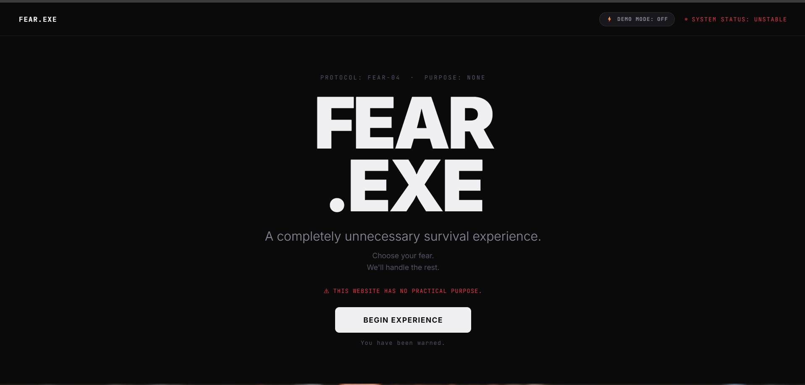
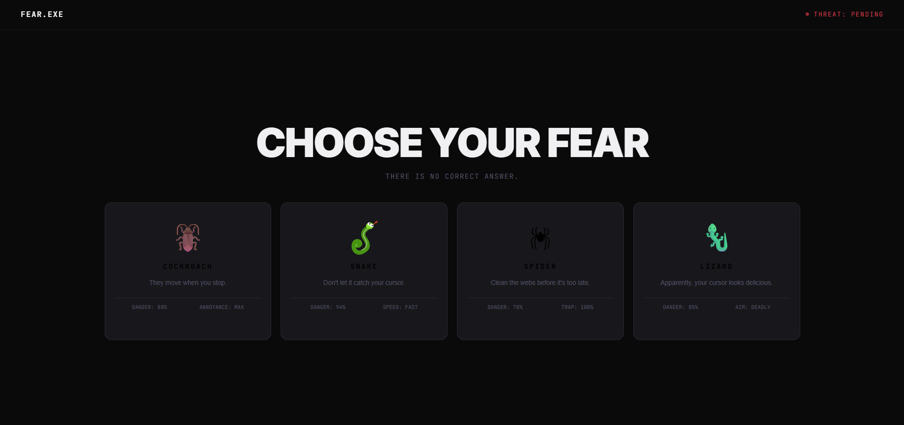
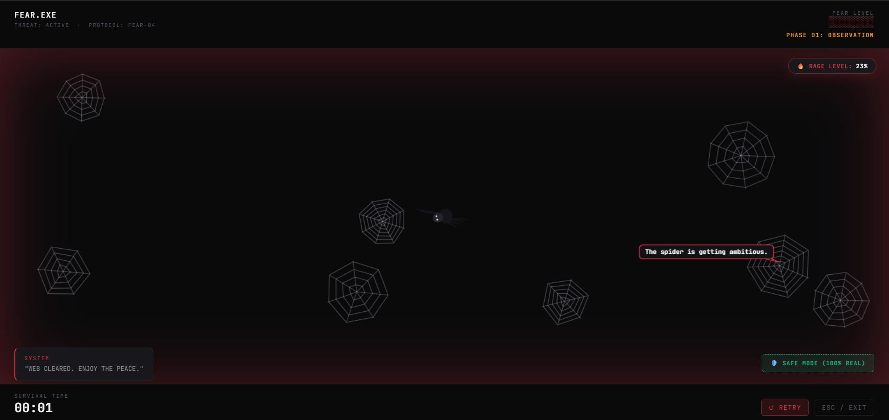
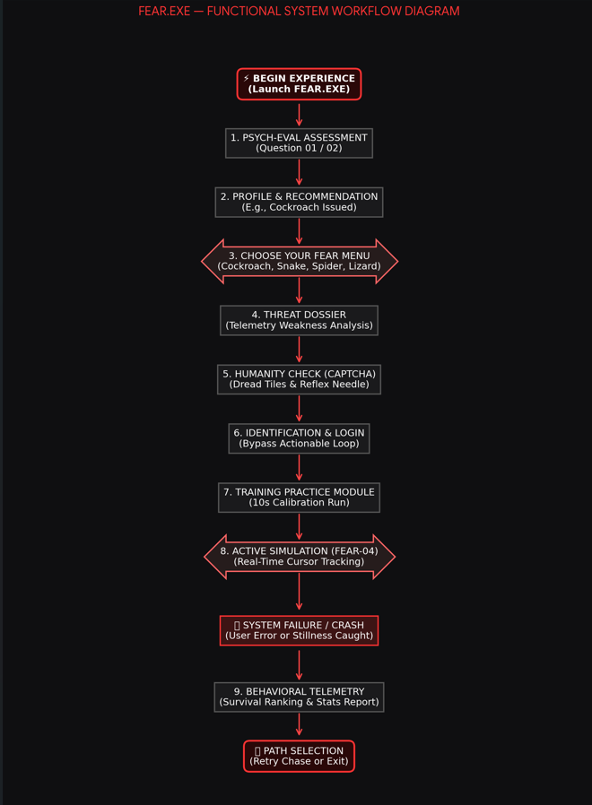

# FEAR.EXE 🎯

# Live Demo:https://fear-exe.vercel.app/

## Basic Details
### Team Name: Runtime Terrors

### Team Members
- Team Lead: Madhav S Pillai - Sree Buddha College of Engineering

### Project Description
FEAR.EXE is a deliberately useless fear-simulation platform that turns everyday fears into interactive browser-based challenges. Users face ridiculous simulations involving cockroaches, snakes, spiders, and lizards, complete with escalating chaos and fake psychological analysis.

### The Problem (that doesn't exist)
FEAR.EXE solves the completely unnecessary problem of people not being sufficiently afraid while using the internet. It turns everyday fears into ridiculous interactive challenges, because apparently normal web browsing wasn’t stressful enough.

### The Solution (that nobody asked for)
FEAR.EXE uses a highly advanced system of unnecessary fear. Users answer a totally scientific™ assessment, receive a questionable psychological profile, and are thrown into interactive fear simulations involving cockroaches, snakes, spiders, and lizards. The longer they survive, the worse it gets—because quitting is apparently not an option.

## Technical Details
### Technologies/Components Used
For Software:
- Languages used: HTML5, CSS3, JavaScript
- Frameworks used: None — built as a standalone web application
- Libraries used: HTML Canvas API, Web Audio API
- Tools used: Antigravity IDE, GitHub, Web Browser

For Hardware: N/A

### Implementation
For Software:
# Installation
git clone (https://github.com/tinkerhub/useless_project_temp.git)
cd FEAR.EXE

# Run
Execute index.html as live server

### Project Documentation
For Software:

# Screenshots (Add at least 3)
![Screenshot1]
*The front page of the webpage*

![Screenshot2]
*Selection of what type of fear*

![Screenshot3]
*Fear simulation*

# Diagrams
![Workflow]
*Workflow of FEAR.EXE*

## Team Contributions
- Madhav S Pillai: Designed and developed the complete FEAR.EXE project, including UI/UX, interactive fear simulations, procedural animations, assessment system, psychological profiling, audio integration, game logic, and final presentation.

---
Made with ❤️ at TinkerHub Useless Projects 

